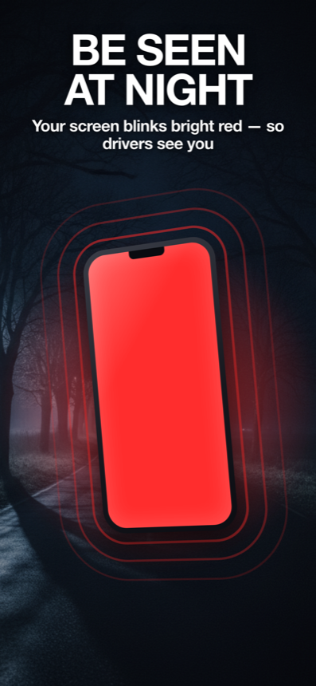
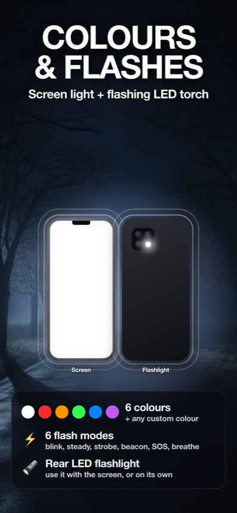
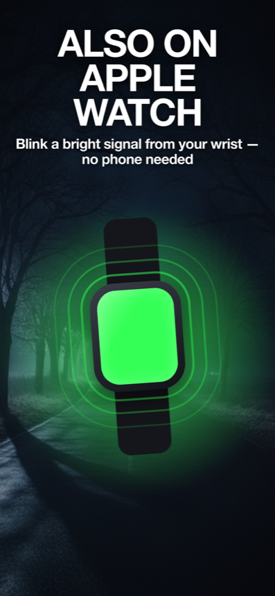

# Safety Light — Flash & Signal

### See the path ahead. Be seen by traffic and others in the dark. 🔦

A flashlight **and** a high-visibility signal light for iPhone and Apple Watch. Light your way with the rear LED torch, and turn your whole screen into a bright colour so drivers, cyclists and others notice you at night.

<table>
  <tr>
    <td align="center" width="33%"> <b>Be seen</b> — full-screen red, blinking</td>
    <td align="center" width="33%"> <b>Both at once</b> — screen colour + rear torch, in sync</td>
    <td align="center" width="33%"> <b>Standalone Watch</b> — green signal light</td>
  </tr>
</table>

> **This repository is the app's website, not its source code.** It hosts only the Privacy Policy and Support pages, served via GitHub Pages. The Safety Light app source lives in a separate, private repository. See [About this repository](#about-this-repository) below.

---

## What it does

Built for the dark: walking home after dark, running before sunrise, cycling unlit roads, dog-walking, hiking and camping, roadside breakdowns, power cuts, and festivals or concerts.

### Two lights on iPhone

- **See the path** — the rear LED torch lights the ground ahead of you.
- **Be seen** — the whole screen fills with one solid colour, visible from far away.
- **Use one at a time, or both at once** — when both are on, they flash in the same pattern together.

### iPhone + Apple Watch, one purchase

- A single purchase covers both the iPhone app and the Apple Watch app.
- The **Watch app runs standalone** — leave the phone behind and still signal from your wrist.
- The Watch has no LED, so it uses its **screen** as the light.

### Colours

**White · Red · Amber · Green · Blue · Violet**, plus a **custom colour slider**.

- **Red** preserves your night vision.
- **Amber, green and blue** are high-visibility "notice me" colours.

### Flash modes

**Blink · Steady · Strobe · Beacon · SOS (Morse) · Breathe.**

---

## Simple, private, yours

- **One-time purchase — €0.99 / $0.99.** Buy it once; iPhone and Apple Watch included.
- **No subscription, no ads, no in-app purchases, no account or login.**
- 🔒 **No data collected, no tracking.** Works fully offline and requests no permissions.

---

## Safety note

Safety Light is a **visibility aid**, not a substitute for regulated safety gear. The **Strobe** and **Blink** modes flash rapidly — please take care if you or anyone nearby is photosensitive.

---

## About this repository

This **public** repository hosts **only the app's small website** — the **Privacy Policy** and **Support** pages, published with GitHub Pages. **It is not the app's source code**; the Safety Light app source is kept in a separate private repository.

- 🌐 **Website:** https://duskysk.github.io/safetylight-legal/
- **Support:** https://duskysk.github.io/safetylight-legal/support.html
- **Privacy Policy:** https://duskysk.github.io/safetylight-legal/privacy.html
